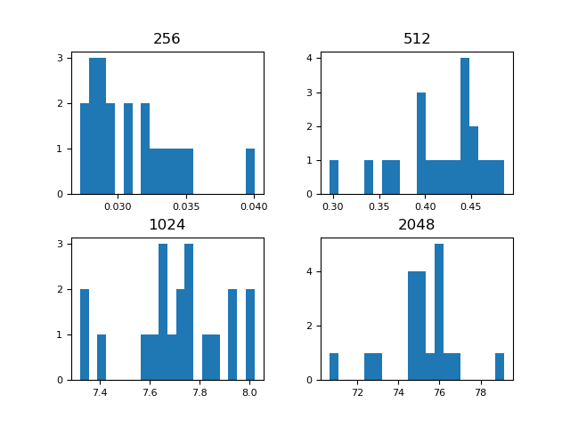
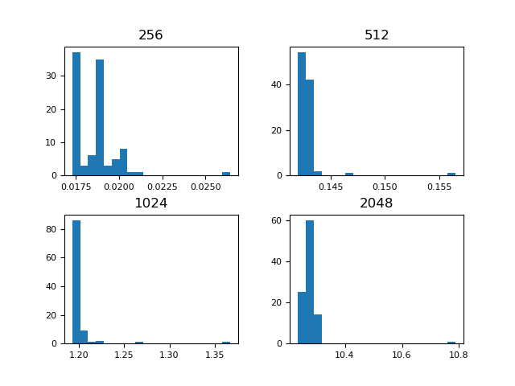
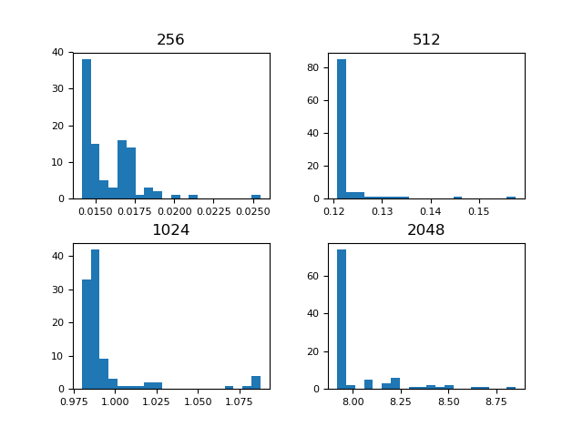

# MAC0219 - MiniEP2 - Otimizando a cache

---

Neste EP, procuramos uma forma eficiente de multiplicarmos duas matrizes, usando o cache em nosso favor, para assim, obter uma melhor performance, resultado em um menor tempo de execução.

Para excutar faça `make test`.

## Explicando as funções

O arquivo `matrix.c` possui 3 versões da função `matrix_dgemm`. Aqui explico o funcionamento de cada uma:

- `matrix_dgemm_0()`: Função fornecida e implementada pelos monitores. Realiza a multiplicação de duas matrizes de uma maneira mais *humana*, realizando a somatória dos produtos entre uma linha e uma coluna para calcular cada posição da matriz resultante. Tal implementação não aproveita o cache, pois, a cada leitura, uma parte de uma linha é armazenada no cache, e tal implementação faz com que isso só seja aproveitado em uma matriz, provocando diversos **cache_misses** na matriz que é iterada por coluna.

- `matrix_dgemm_1()`: Função implementada por mim. Essa função acaba sendo apenas uma reordenação na ordem dos `for`'s da função anterior. Porém, tal reordenação é essencial, pois faz com que o cache possa ser aproveitado, fazendo com que as duas matrizes sejam iteradas por suas linhas, sendo que cada posição da matriz resultante é construída de forma gradual. O ganho no uso do cache resultou em um código 10 vezes mais rápido.

- `matrix_dgemm_2()`: Função implementada por mim. Nessa última função, usamos a mesma ideia da anterior, porém, agora, divido as minhas matrizes em blocos, fazendo com que o trabalho fique ainda mais dividido e o aproveitamento do cache seja ainda maior. Em meus testes, o tamanho ideal de um bloco é 64 posições de variáveis double. Essa implementação, possibilitou um código 20% mais rápido que o anterior.

## Análise estatística

Nessa sessão, realizo a parte estatística do relatório, mostrando gráficos e respondendo as perguntas acerca dos tempos de execução. Os histogramas presentes a seguir são resultado de 100 execuções do programa `main.c` para cada função e para cada um dos seguintes tamanhos de matriz: 256x256, 512x512, 1024x1024 e 2048x2048. Os tempos de execução destes 1200 experimentos também me permitiram construir a seguinte tabela, que possui a média dos tempos de execução e o desvio padrão.

|  &nbsp;&nbsp;&nbsp;&nbsp;&nbsp;&nbsp;&nbsp;256x256&nbsp;&nbsp;&nbsp;&nbsp;&nbsp;&nbsp;&nbsp; | &nbsp;&nbsp;&nbsp;&nbsp;&nbsp;&nbsp;&nbsp;512x512&nbsp;&nbsp;&nbsp;&nbsp;&nbsp;&nbsp;&nbsp; | &nbsp;&nbsp;&nbsp;&nbsp;&nbsp;&nbsp;1024x1024&nbsp;&nbsp;&nbsp;&nbsp;&nbsp;&nbsp; | &nbsp;&nbsp;&nbsp;&nbsp;&nbsp;&nbsp;2048x2048&nbsp;&nbsp;&nbsp;&nbsp;&nbsp;&nbsp; |
| --- | --- | --- | --- |
|Media: 0.031043s Desvio padrão: 0.003161s|Media: 0.416027s Desvio padrão: 0.047224s|Media: 7.710162s Desvio padrão: 0.194550s|Media: 75.20450s Desvio padrão: 1.699873s|
|Media: 0.018566s Desvio padrão: 0.001261s|Media: 0.142864s Desvio padrão: 0.001467s|Media: 1.200644s Desvio padrão: 0.018748s|Media: 10.27788s Desvio padrão: 0.053188s|
|Media: 0.015810s Desvio padrão: 0.001775s|Media: 0.122672s Desvio padrão: 0.004730s|Media: 0.994167s Desvio padrão: 0.024027s|Media: 8.024439s Desvio padrão: 0.187672s|  

(Por limitação do conversor de markdown para PDF, não consegui colocar a titulo de cada linha. Logo, a primeira linha representa a função matrix_dgemm_0(), a segunda matrix_dgemm_1() e a ultima linha matrix_dgemm_2())

Os eixos x e y dos histogramas a seguir apresentam os tempos de execução (em s) e a frequência (em %) de cada tempo, respectivamente.

- **matrix_dgemm_0:**

- **matrix_dgemm_1:**

- **matrix_dgemm_2:**

> 1. Mostre, com embasamento estatístico, a variação de tempo entre matrix_dgemm_1 e sua implementação de matrix_dgemm_0. Houve melhora no tempo de execução? Explique porque.

Seguindo os dados da tabela, tivemos uma redução de aproximadamente 85% do tempo necessário para realizar a multiplicação de duas matrizes, uma melhora considerável e muito significativa. Para uma matriz com tamanho 2048x2048, a diminuição foi de 65 segundos. Tal fato se deve ao uso do cache realizado pela função matrix_dgemm_1(), que, assim como explicado na primeira sessão, realiza a multiplicação percorrendo as linhas de ambas matrizes, fazendo com que os dados no cache possam ser utilizados.

> 2. Mostre, com embasamento estatístico, a variação de tempo entre matrix_dgemm_2 e sua implementação de matrix_dgemm_1. Houve melhora no tempo de execução? Explique porque.

Na última implementação, obtemos um ganho de aproximadamente 20% em relação à implantação anterior. Fazendo com que ganhemos 2 segundos na multiplicação de matrizes com tamanho 2048x2048. Esse ganho foi fruto de um aproveitamento ainda maior do cache, utilizando a técnica de blocagem, fazemos com que o uso de um pedaço que já está no cache seja maximizado, através de testes, definir o tamanho de um bloco como 64 unidades de double.

> 3. Como você usou a blocagem para melhorar a velocidade da multiplicação de matrizes?

Defini um bloco com tamanho de 64 unidade de double, dessa forma, aí se multiplicar duas matrizes, é definido o número de blocos em que a matriz vai ser dividida. Com tal divisão, a multiplicação, apesar de mais difícil para um humano, fica mais fácil e rápida para um computador, pois ele consegue obter um ganho ainda maior do uso do cache, podendo realizar diversas operações com uma linha que já está no cache, sendo que essa mesma informação, após ser removida, nunca mais voltará para lá.
