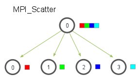

# Mandelbrot distribuído
## MAC0219 - IME | USP

---

- Felipe Castro de Noronha - 10737032
- Rafael Tsuha - 10692162

---

Neste EP, expandimos a geração do conjunto de Mandelbrot para um sistema distribuído de computadores.

Execute da seguinte maneira:

    make
    mpiexec -np <NUM_COMP> ./dmbrot <C0_REAL> <...> <SAÍDA>

Onde NUM_COMP é o número de computadores na rede. O restante dos parâmetros são os mesmos da parte anterior.

O programa foi testado em nossas máquinas com uma placa de video GeForce 940MX, não conseguimos rodar na dota por problemas de permissão.

No makefile foi necessário adicionar o caminho para a biblioteca do openmpi na máquina em que testamos com -L/usr/lib/openmpi/, talvez esse caminho precise ser alterado em outras máquinas.

## O que foi feito

Adaptamos o código do EP anterior para funcionar em uma rede de processamento distribuída. Tal trabalho é realizado pela interface `OpenMPI`, que fornece uma biblioteca completa e robusta para o trabalho usando várias máquinas. Mesmo para testes locais, com apenas 1 computador, a interface distribui o processamento pela rede local, fazendo possível um ambiente de testes confiável e parecido com o do mundo real.

## Como foi feito

Nada substancial foi mudado, em relação ao EP anterior, para o cálculo do conjunto de mandelbrot. Porém, agora, o vetor `calc[]` é inicializado apenas no processo raiz, que tem id 0. Sua inicialização faz com que o valor de `calc[i]` seja igual a `i`, onde `i` representa um certo pixel da imagem. O vetor `calc[]` possui `n_pixel` posições, onde `n_pixel` é o número total de pixels na imagem.

A seguir, cada processo calcula quantos pixels ele vai *processar*, de forma que todos os processos cuidem, aproximadamente, da mesma quantidade de pixels. Com a chamada da função `MPI_Scatterv()`, enviamos partes do vetor `calc[]` para todos os processos, após isso, cada processo vai ter um vetor `calc local[]`, que representa somente a posição da imagem que ele irá cuidar, como exemplificado na imagem a seguir:

Note que, `calc_local[]` é um vetor distinto em cada processo, contendo um intervalo unico de números, que representam os pixels a serem *processados*. Essa constitui a única alteração nas funções que realizam o cálculo do conjunto. Agora, tais funções utilizam o id `i` para obter a posição no plano imaginário de dado pixel.

Ao final da execução dos processos, a função `MPI_Gatherv()` recolhe as *partes dos vetores* de cada processo e as reune no vetor `calc[]`, agora, o vetor `calc[]` armazena o número de iterações para cada pixel, como ilustrado na imagem abaixo:

Fazemos com que apenas o processo raiz gere a imagem, após isso, o programa é finalizado.

## Desafios encontrados

O maior desafio foi encontrar uma maneira eficiente de enviar e recuperar os dados de todos os processos, além de que, os dados podem ter uma variância de 1 unidade em seu tamanho. Através da leitura da documentação do `OpenMPI`, encontramos as duas funções utilizadas, que serviram perfeitamente para a nossa necessidade, além de apresentarem ótima performance.
