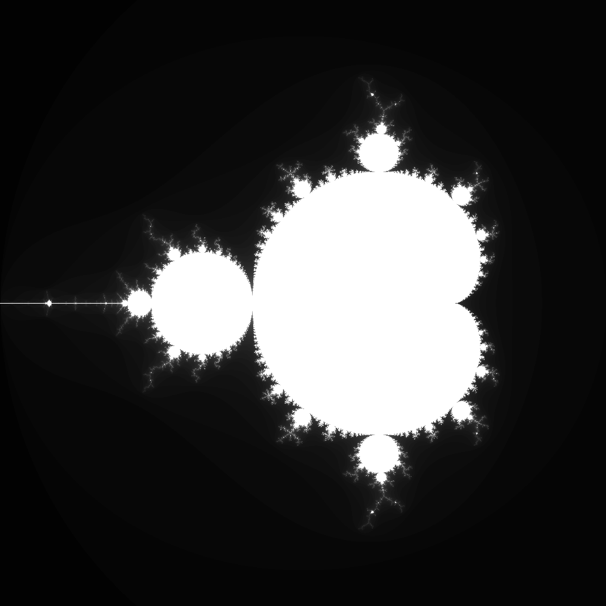

# EP2 - Mandelbrot
- Felipe Noronha - 10737032
- Rafael Tsuha - 10692162

---



Nesse EP, usamos OpenMP e Cuda para implementar a geração de imagens do fractal de Mandelbrot. Para isso, basta executar

```terminal
make
./mbrot <C0_REAL> <C0_IMAG> <C1_REAL> <C1_IMAG> <W> <H> <CPU/GPU> <THREADS> <SAIDA>
```

## Como foi implementado

Primeiramente, todos os argumentos passados para o programa são traduzidos para uma estrutura. Tal feito possibilita que os dados requeridos sejam passados com constância durante toda sua execução.

O *core* do programa se traduz na criação da matriz `calc`, a forma em que ela é gerada vai ser discutida mais á frente. Basicamente, essa matriz possui **H** linhas e **W** colunas, ou seja, possui a mesma dimensão da imagem a ser gerada. Cada posição **i, j** da matriz representa uma coordenada no plano imaginario, assim, cada posição da matriz vai armazenar o numero de iterações que aquela coordenada levou para divergir, de acordo com a heuristica definida no enunciado.

Com essa matriz em mãos, processeguimos para a criação da imagem, que é feita com a biblioteca `lpng`. Com seu uso, geramos uma imagem com a extensão `.png` que é salva no caminho especificado como argumento.

### Gerando a matriz calc na CPU

Para realizar os calculos com o processamento da **CPU** usamos a interface OpenMP, que nos possibilitou a implementação de *mutithreading* de forma facil e rapida. A ideia usada foi a seguinte: a função `cpu_make_iterations` vai popular a matriz `calc`, passando por todas as possiveis coordenadas no plano imaginario dentro dos limites definidos como argumento; já a função `cpu_iterate` é responsavel por definir quantas iterações são necessarias para que uma dada coordenada divirja, de acordo com a heuristica definida. Desse modo, `cpu_make_iterations` vai popular `calc` realizando chamadas de `cpu_iterate`.

A paralelização acontece com a chamada de `#pragma omp parallel for num_threads(arg->threads)`, que paraleliza o loop dentro de `cpu_make_iterations` que realiza a passagem em todas as possiveis coordenadas.

###  Gerando a matriz calc na GPU

Na realização dos calculos com recursos da GPU é onde o uso de `Cuda` se mostrou necessario. Com todo o suporte para a alocação e utilização dos recursos da GPU, é aplicada a seguinte ideia: agora, a função `gpu_make_iterations` divide as tarefas por *sessão* da imagem, assim, a cada ciclo de execução da GPU uma nova sessão de `calc` é calculada, sendo que cada thread mantem informações á respeito de onde ela vai trabalhar. Uma sessão tem seu tamanho definido por **num_blocos*num_threads**.

Desse modo, a função `gpu_make_iterations` popula `calc` de maneira analoga á forma realizada a CPU, chamando a função `gpu_iterate` para cada posição.

### Considerações

- Apesar de termos nos referido a `calc` como sendo uma matriz, por motivos de performance, ela é implementada como uma array unidimensional.

- Independemente do meio escolhido (CPU ou GPU) para a realização da principal parte do programa, a geração da imagem é sempre realizada com recursos da CPU.

Analise de dados

Rodamos testes para a cpu e gpu variando o numero de blocos e threads segundo as tabelas a seguir gerada pelo script2.sh.
na tabela, tempo representa o tempo medio, e ci é o intervalo de confiança

cpu:
threads	| tempo	 | ci		|media-ci|media+ci
---|---|---|---|---
1		|0.378674| 0.012151 |0.366523|0.390825
320		|0.034342| 0.002318 |0.032024|0.036660
640		|0.033616| 0.001115 |0.032501|0.034731
960		|0.038846| 0.001191 |0.037655|0.040037

gpu 1 bloco:
threads | tempo	 | ci		|media-ci|media+ci
---|---|---|---|---
1		|7.652662| 0.023926 |7.628736|7.676588

gpu 320 blocos:
threads | tempo	 | ci	   |media-ci|media+ci
---|---|---|---|---
320		|2.680848|0.025645 |2.655203 |2.706493
640		|2.712928|0.016758 |2.696170 |2.729686
960		|2.684028|0.023503 |2.660525 |2.707531

gpu 640 blocos:
threads | tempo	 | ci	   |media-ci|media+ci
---|---|---|---|---
320		|2.700212|0.021178 |2.679034|2.721390
640		|2.664104|0.026010 |2.638094|2.690114
960		|2.592908|0.126460 |2.466448|2.719368
