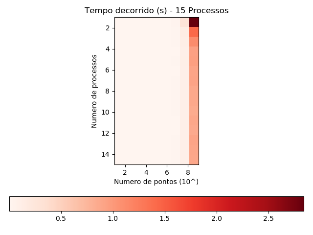
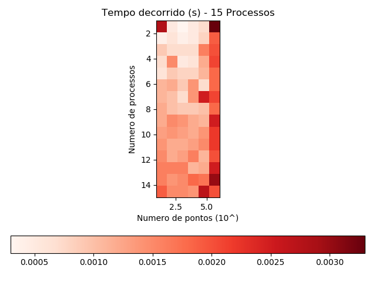

# MiniEP3 - Paralelismo com Processos
### Felipe Castro de Noronha | IME-USP | 2019

---

## Calculando Pi usando integração de Riemann

Este EP tem como intuito calcular uma aproximação do numero Pi usando a integração de Riemann da função f(x) = sqrt(1 - x²). Para isso, é necessario ter em mãos o numero de pontos que queremos para a aproximação, ou seja, o numero de partes do grafico de f(x) que a nossa aproximação vai ser constituida.

Por motivos de performance, usamos o conceito de processos, na qual *copias do programa* são geradas e sua execução e gerenciada pelo SO. Dessa maneira, podemos fazer com que o programa seja executado de forma rapida e eficiente, inclusive, em paralelo.

# Como foi feito

Para realizar este EP tomei como base as seguintes referencias:

1. [Codigo disponibilizado no github](https://github.com/matheustavares/pi/blob/master/pi.c) pelos monitores. Tal codigo divide a terefa de calcular a integral de Riemann em intervalos, sendo que cada intervalo é calculado por uma thread;
2. [Essas notas de aula](http://www.cs.uni.edu/~fienup/cs143f00/course-notes,-in-class-activitie/lec4_8-31-00.lwp/odyframe.htm) que mostram e explicam sobre processos.
3. Diversos artigos no Stack Overflow;
4. Referencias e manuais de funções.

## Como funciona

Aqui, mostrarei o funcionamento do EP, na ordem em que as coisas acontecem:

1. Leio os argumentos passados ao programa, `num_processes` e `num_points`;
2. Crio a memoria compartilhada, que ira ser usada por todos os subprocessos. Primeiro, é criado um objeto de memoria compartilhada do UNIX, com a função `shm_open()`. Logo apos, defino o tamanho que esse objeto vai ter, com a função `ftruncate()`. Finalmente, aloco essa objeto em um endereço de memoria virtual, usando o `mmap()`.
3. Em seguida, é iniciada a principal parte de execução do programa.
    - Calculo do numero de processos que vão calcular um intervalo um pouco maior.
    - Inicio do loop, que itera no intervalo [0, num_processes]. Esse loop, no processo pai, realiza a criação de todo os processos filhos e guarda o `pid` de cada um. Nos processos filhos, acontece só uma parte do codigo interno do loop, que é responsavel por calcular o inicio e o fim do intervalo que este sub-processo calcula, realizar o calculo e guarda-lo na memoria compartilhada.
4. Ao termino dessa parte, o programa espera que todos os processos terminem e calcula o valor final da aproximação, atravez da soma de todas as posições da memoria compartilhada.
5. Finalmente, é realizada a limpeza dos recursos alocados.

# Conclusões

Na questão de aproximação o EP realiza um otimo trabalho. Com aproximadamente 10000 pontos ja podemos obter uma aproximação muito satisfatoria do numero pi.

Sobre o tempo de execução. Como mostra o grafico de calor abaixo, a variação de tempo de execução do programa, entre o numero de processos e o numero de pontos se torna um pouco insignificante, quando se calcula com numeros muito grandes de pontos (10^9).

  

Agora, para o grafico de calor abaixo, diminuimos o numero maximo de pontos calculados (10^6). Com ele podemos notar algo muito importante, **o overhead de criação de novos processos faz com que tal feito torne o calculo mais demorado, para um numero razoavelmente grande de pontos**.

Um outro fato que notei atravez, porém, não é muito visivel pelos graficos, é que o ganho de tempo tem uma relação com o numero de threds da CPU. Em particular, o ganho no tempo de execução só se deu com um numero de processos menor que cinco (minha CPU possui 4 threads). Logo, não existe nenhum ganho real em se executar o programa com um numero de processos maior que o numero de threads do seu computador. Tal fato se deve ao SO, que tenta dividir todos os processos de forma uniforme entre as threads disponiveis.
